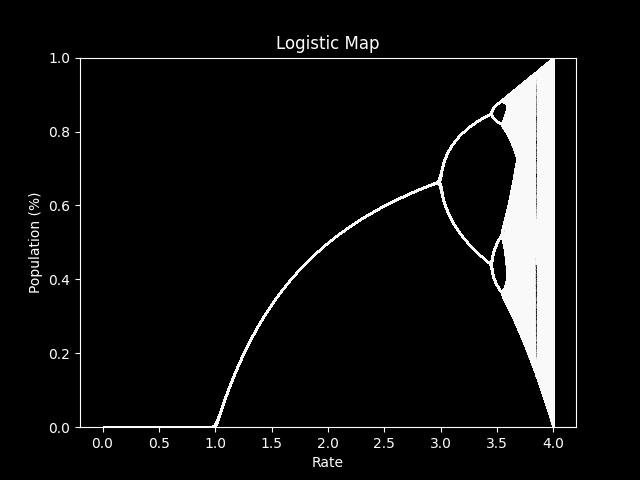

# LogisticMap (Using matplotlib)

LogisticMap is just my python implementation of the [Logistic Map](https://en.wikipedia.org/wiki/Logistic_map)
with the `matplotlib` module. The diagram is called `bifurcation.py` and a bonus logistic function viewer
is called `logistic.py`.

In `bifurcation.py`, there will be two variables - `res` and `amount` - of which you can change to your liking. 

If you're wondering, here's what the diagram will look like:

Have fun with it, I guess.